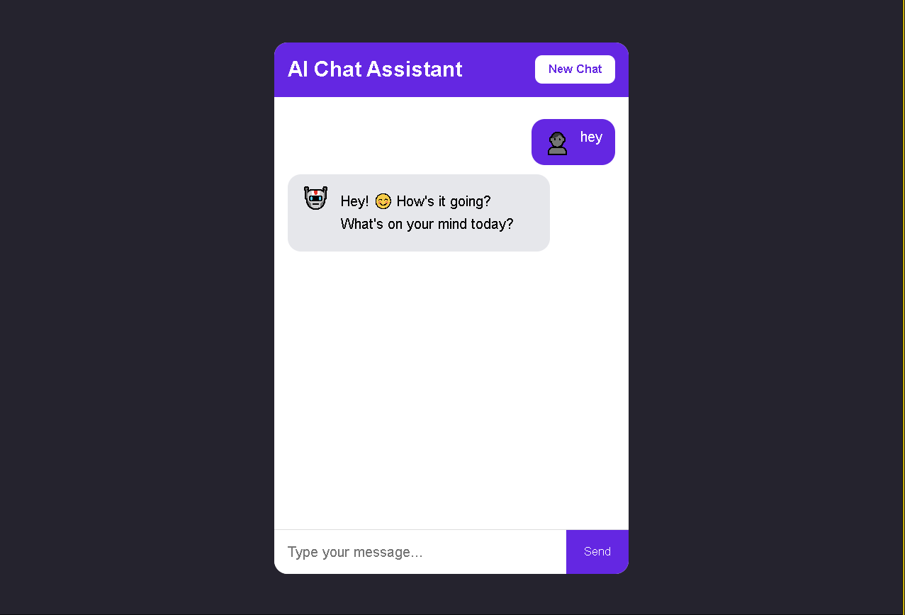

# 🤖 AI Chat Assistant


A modern AI chatbot built with HTML, CSS, JavaScript, Node.js, Express, and the OpenRouter API.


## Features


- 💬 AI-powered conversations
- ⚡ Fast responses
- 🧹 New Chat button
- 💾 Chat history saved in Local Storage
- 📱 Responsive design
- 🔒 Secure API key using .env


## Technologies Used


- HTML
- CSS
- JavaScript
- Node.js
- Express.js
- OpenRouter API


## Installation


```bash
npm install
node server.js
```


Open:


```
http://localhost:3000
```


## Author
Sami Ullah
